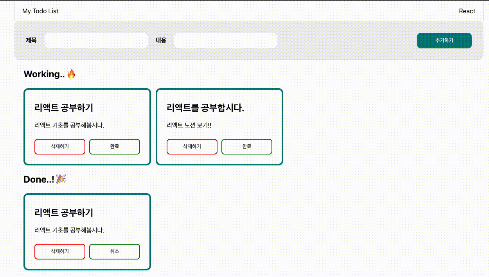
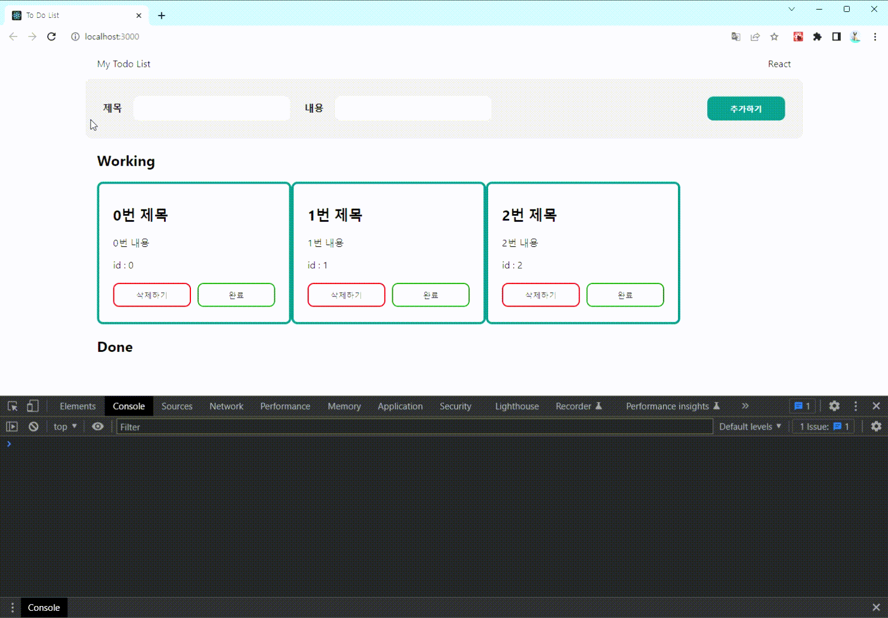

# <b>React로 To Do List 만들기</b>
<div align="center">


</div>

<br/><br/>

# :dart: 요구사항
<div align="center">



</div>

* 구현해야 할 기능
  - UI 구현하기
  - Todo 추가하기
  - Todo 삭제하기
  - Todo 완료 상태 변경하기 (완료 ↔ 진행중)
  
* 디자인은 자유이나 화면 구성은 동일하게 진행

* 제목과 내용을 입력하고, `추가하기` 버튼 클릭 시 Working에 새로운 Todo 추가
  - 추가 완료되면 제목, 내용 input 빈 값으로 바뀌도록 구성
  
* Todo의 `isDone` 상태가 true면 상태 버튼의 라벨을 `취소`, 상태가 false면 버튼의 라벨을 `완료`로 조건부 렌더링

* Todo의 상태가 `Working`이면 위쪽에 위치, `Done`이면 아래쪽에 위치

* Layout 최대 넓이는 `1200px`, 최소 넓이는 `800px`로 제한하고, 전체 화면의 가운데로 정렬

* 컴포넌트 구조는 자유롭게 구현하고 분리한 컴포넌트는 `README`에 작성

<br/><br/>

# :open_file_folder: 컴포넌트 분리 구조
```bash
📦src
 ┣ 📂components
 ┃ ┣ 📜Form.jsx
 ┃ ┣ 📜Header.jsx
 ┃ ┣ 📜ListWorking.jsx
 ┃ ┣ 📜ListDone.jsx
 ┃ ┗ 📜ListMap.jsx
 ┣ 📜App.css
 ┣ 📜App.jsx
 ┣ 📜index.js
 ┗ 📜reportWebVitals.js
```

<br/><br/>

# :bomb: 트러블슈팅
<div align="center">



</div>

## <b>문제 상황 </b>

* id를 todo.length, 또는 todo.length + 1 등으로 설정했을 때, 배열 중간 값을 삭제한 뒤 새로운 배열을 추가하면 id가 중복되는 현상이 발생했다.

<br/>

## <b>해당 코드</b>
```javascript
const newTodo = {
  id: todo.length + 1,
  title,
  body,
  isDone: false,
};
```

<br/>

## <b>원인</b>
* React에서 `key`는 어떤 항목을 변경, 추가, 또는 삭제할지 **식별**하는 것을 돕는다. key가 없으면 변경이 필요하지 않은 리스트의 요소까지 변경이 일어나게 되어 비효율적이기 때문이다.

* 이러한 부분을 개선하기 위해 객체에서는 key로 사용할 수 있는 `고유한 값(id)`을 지정한다.

* key는 전체 범위에서 고유할 필요는 없으나 `형제 사이에서는 고유한 값이어야 한다.`

* 그러므로 `todo.length` 또는 `todo.length + 1`과 같이 같은 레벨 내에서 중복되는 값이 id로 설정되면 warning이 발생한다.

<br/>

## <b>해결 방법</b>
* React 공식문서에서 아래의 두가지는 id로의 사용을 지양하고 있다.
  - 위와 같이 가운데 항목이 제거될 경우 새로 추가되는 id값이 `중복될 가능성`이 있는 `index`
  - key다시 렌더링하는 과정동안 `안정적으로 식별 가능`해야 하는데, 암호학적으로 안전한 난수를 제공하지 않는 `Math.random()`

<br/>

* 따라서 JavaScript용 고유 문자열 ID 생성기인 `nanoid`를 설치해 사용했다.
  - nanoid는 크기가 작으며, 하드웨어 랜덤 생성기를 사용해 안전하다.


```javascript
import { nanoid } from 'nanoid';
...
const newTodo = {
  id: nanoid(),
  title,
  body,
  isDone: false,
};
``` 