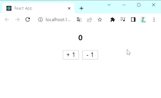
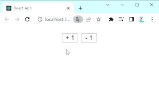

# <b>React로 Counter App 만들기</b>
<div align="center">



</div>

<br/><br/>

# :dart: 요구사항
* `useState`와 `이벤트핸들러`를 이용해 완성한다.
* `App.jsx`에 코드를 작성한다.
* `+1` 버튼을 누를 때마다 숫자가 +1 증가한다.
* `-1` 버튼을 누를 때마다 숫자가 -1 감소한다.

<br/><br/>

# :bomb: 트러블슈팅
<div align="center">



</div>

## <b>문제 상황</b>

1. 맨 처음 렌더링이 됐을 떄 count값에 0을 띄워줘야 하는데 +1, -1을 클릭했을 때부터 해당 값이 출력되었다.

2. 동일한 코드임에도 불구하고 count가 어떤 때에는 String으로, 어떤 때에는 Number로 설정되었다.

<br/>

## <b>해당 코드</b>
```javascript
import { useState } from 'react';
import './App.css';

function App() {  
  let [num, setNum] = useState('');
  const plusHandler = () => setNum(num + 1);
  const minusHandler = () => setNum(num - 1);
  return (
    <div id="wrap">
      <h1>{num}</h1>
      <button
        onClick={plusHandler}
      >
        +
      </button>
      <button
        onClick={minusHandler}
      >
        -
      </button>
    </div>
  )
}

export default App;
```

<br/>

## <b>해결 방법</b>
* 두 문제 모두 `let [num, setNum] = useState()`에서 state의 초기값을 '' 문자열로 지정했기 때문이었다.
* 초기값을 숫자인 `0`으로 지정하여 해결하였다.
```javascript
let [num, setNum] = useState(0);
```